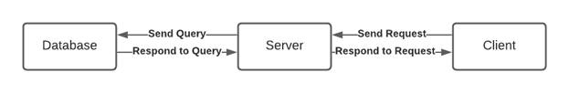
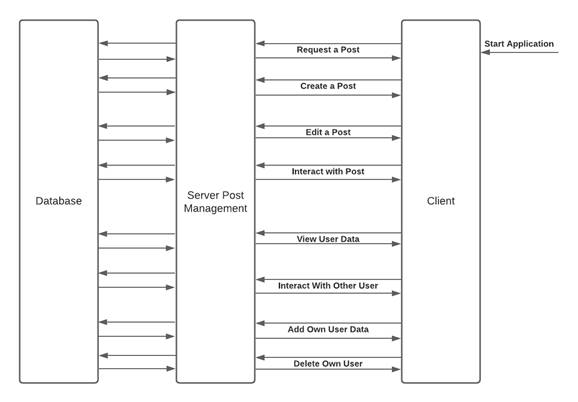
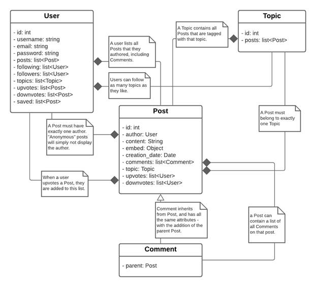
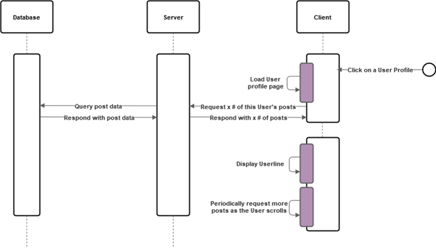
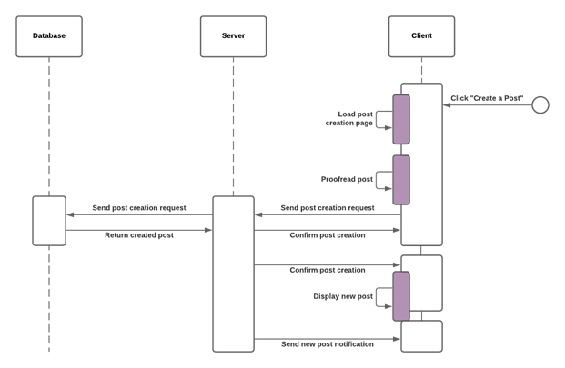

CS 30700: Design Document

Mark Hartigan

Nicholas Masso

Kyle Vandewalle

Zach George

Zach McClary

Index
=====

[**Purpose**](#purpose)

  * [Functional Requirements](#functional-requirements)

  * [Non-functional Requirements](#non-functional-requirements)

[**Design Outline**](#design-outline)

  * [High Level Overview](#high-level-overview)

  * [Sequence of Events Overview](#sequence-of-events-overview)

[**Design Issues**](#design-issues)

  * [Functional Issues](#functional-issues)

  * [Non-functional Issues](#non-functional-issues)

[**Design Details**](#design-details)

  * [Class Design](#class-design)

  * [Classes and Interactions](#classes-and-interactions)

    * [User](#user)

    * [Post](#post)

    * [Comment](#comment)

    * [Topic](#topic)

  * [Sequence Diagram](#sequence-diagram)

    * [Login Sequence of Events](#login-sequence-of-events)

    * [Viewing User Timeline Sequence of Events](#viewing-user-timeline-sequence-of-events)

    * [Creating a Post Sequence of Events](#creating-a-post-sequence-of-events)

Purpose
=======

Many social media platforms occupy our attention today. However, as the internet shifted in recent years from forum-style message boards to content aggregation, the public eye has turned its lens to the individual rather than the community.  Bitwise will be a fun social media site that includes elements of popular platforms like Twitter, Facebook, and Reddit while allowing connection of users by common interest, or topics. Current social media sites are tailored to a wide audience, which makes them not as fit for dealing with small communities and topics -- Bitwise seeks to solve this problem. Users will be able to create new posts and topics, tag posts with topics, and interact with other users' posts in an elegant and modern format.

Functional Requirements
-----------------------

1. Account and Profile: As a user, I would like to...

    a. Register an account using a Google email and password

    b. Setup a secure account password

    c. Edit my public profile and private personal information

    d. Delete my user account and any associated data

    e. Be able to log in and out

2. Posting and Viewing Posts: As a user, I would like to...

    a. Make posts tagged with topics

    b. Be able to create new topics

    c. See all posts associated with a given topic

    d. Be able to post anonymously

    e. Be able to view the users and topics I follow

    f. Be able to view my liked, disliked, and saved posts

3. Following and Post Interaction: As a user, I would like to...

    a. Search for a user or topic

    b. Search for a specific post (if time allows)

    c. Follow or unfollow users or topics

    d. Have posts from users from followed topics and users appear in my timeline

    e. Have my timeline and post history to appear reverse chronologically

    f. Save posts from other users

    g. Upvote or downvote posts from other users

    h. Comment on a specific post

    i. View another person's profile

    j. View a timeline of another user's content on their profile

4. User Experience: As a user, I would like to...

    a. Be able to view the website on mobile or desktop

    b. Be able to switch site color schemes

    c. Be able to change settings on the website to accommodate for disabilities

    d. Infinitely scroll through timelines

Non-functional Requirements
---------------------------

5. Performance: As a developer, I would like...

    a. The website to run smoothly

    b. The website to support at least 1000 concurrent users

6. Server: As a developer, I would like...

    a. The server to be able to handle real time communication between itself and the client for all requests made by the user

    b. The server to be able to handle and store user data instantly.

7. User Interface: As a developer, I would like...

    a. The website to be easy to use, navigate, and understand

    b. The website to be compatible with most browsers (Chrome, Firefox, etc.)

    c. The website to be user friendly

    d. The website to be aesthetically pleasing

8. Security: As a developer, I would like...

    a. Passwords to be encrypted so that they are not visible by developers or unauthorized users

    b. To limit one account per individual

Design Outline
==============

High Level Overview
-------------------

This project will be a website that allows users to interact with and post images and text in a manner similar to Twitter. It will use a single server based in the React framework from Javascript that juggles information requests and changes from the entire client base. The server will then transport these information queries into access requests in the database for the project hosted in Firebase, which can either pull or store data. Our point of reference is the design document from the team who built "Show of Hands" for structure of information and diagrams in this section.

--------------------------------------------------------------------------------------------------------------------------

1. Clients

    a. Displays the user interface within the web browser of the users choice.

    b. Takes user input and generates requests that are sent to the server.

    c. Receives responses from the server and changes the user interface accordingly.

2. Server

    a. Accepts and handles requests from clients.

    b. Sends queries to the database to modify and access data based on validated requests from the client.

    c. Generates responses based on requests for data and sends them to a specific client.

3. Database

    a. A document database that stores user data and posts, as well as how each user has interacted with said posts.

    b. Handles queries from the server and sends data back to the server, related to the initial client request.

Sequence of Events Overview
---------------------------

The sequence diagram below is a representation of the standard interactions between the database, server, and clients. Initially, the user starts the web application, prompting the client to log-in. The client can then send requests to the server for user information, which then sends a query for data to be returned from the database on the specific user. The server then authenticates or declines the log-in and sends a response back to the client. The user can then interact with the UI to interact with or create posts, generating a similar sequence of events as above to access, interact with, create, or delete posts. Our point of reference is the design document from the team who built "Show of Hands" for structure of information and diagrams in this section.

Database-Server-Client Relationship Diagram

Forward arrows symbolize responses, while backward arrows symbolize requests.

Design Issues
=============

Functional Issues
-----------------

1. How do users sign up on Bitwise?

    a. Username, Email, Password

    b. Username, Email, Password, Phone number

    c. Username, Google Account

            Chosen Solution: c) Username, Google Account

Justification: Using Google Accounts for sign-in allows us to take advantage of Google's secure authentication as well as email/password storage. Options a) and b) require more feature programming and database storage, whereas option c) already has existing frameworks and tutorials for incorporating Google Account sign-in to websites.

2. What is done about users trying to create similar topics?

    a. Merge similar topics into one

    b. Suggest similar topics as they are being created

    c. Allow any topics without moderation or suggestion

            Chosen Solution: b) Suggest similar topics as they are being created

Justification: Option b) allows for some topic organization without fully moderating posts. This prevents the chaos of having similar topics that are spelled differently be separated into different groups, and makes the user experience easier by having an auto-complete suggestion appear as they are typing their desired topic.

3. How are posts from users and topics followed displayed in a timeline?

    a. Just the post displayed

    b. The post with the top X liked comments displayed

    c. The post with all comments displayed

    d. The post with the user's comments displayed

    e. The post with the user's comments as well as all followed users comments displayed

            Chosen Solution: a) Just the post, no comments

Justification: Bitwise is about simplifying the social media process in a way that is attractive to users as well as easy to follow and sift through. In keeping with the style of the platform, we want the timeline to be as simple as possible. Users can then interact with the posts and comments on that post by clicking on the post itself and going to a separate webpage. This allows for simplicity of viewing, but still allows the same interaction if the post is interesting enough for a user to click on.

4. Which user-followed posts are displayed on a timeline?

    a. Posts

    b. Posts and comments

            Chosen Solution: a) Posts

Justification: If a user is following another user, they would generally want to see what they post. They are much less likely to want to see every comment they make on posts that they follow on topics the user is not interested in. If the user chooses to follow the same topic as that user, they will eventually see the same post and in turn that user's comment on the post, but this method filters out posts on extraneous topics that the user does not follow.

Non-functional Issues
---------------------

1. What database will be used?

    a. AWS

    b. Firebase

    c. MongoDB

    d. Google Cloud

            Chosen Solution: b) Firebase

Justification: Firebase was chosen due to its easier learning curve and ability to host our backend in addition to storing all database information. Furthermore, the plan we chose is free of charge and is sufficient for our application needs.

2. What front-end framework will be used?

    a. React

    b. Angular

    c. Vuejs

    d. jQuery

            Chosen Solution: a) React

Justification: React is an intuitive and "painless" framework for creating a variety of interactive user interfaces, complete with features such as state-managing components. There are numerous tutorials and examples making it easy to learn which is why it was chosen for the front end.

3. What back-end framework will be used?

    a. Django

    b. Node.js

    c. Rails

            Chosen Solution: b) Node.js

Justification: Node.js, as its name suggests, is written in JavaScript, which allows our frontend and backend to be more consistent in terms of programming language. Node.js also offers more than Django, since it is cross-platform and can be implemented for both client and server side apps.

Design Details
==============

Class Design
------------

### Classes and Interactions

#### User

- A User is created when a person creates an account.

- The User's username, email, and password can be used when logging in.

- This can be achieved through a linked Google account.

- The User's ID can be used to reference them.

- The User can create Posts.

- The User has a list of Posts, including Comments, that they have authored.

- This list is updated as new Posts are created, or old posts are deleted.

- Anonymous Posts are still linked to the user, but are not shown on their userline or appear in their post history.

- The User can follow other Users.

- Followed Users are shown to the logged in User.

- Posts made by followed Users are shown on the User's timeline.

- The User can be followed by other Users.

- These users are shown to the User.

- The User can follow Topics.

- Posts in this Topic are shown on the User's timeline.

- The User can upvote/downvote Posts.

- These Posts are listed and the User can view them.

- A User cannot both upvote and downvote the same Post

- The User can save posts.

#### Post

- A Post can be created by a User.

- A Post can be posted anonymously, hiding the User who posted it.

- A Post has content.

- This content can include an embed, like an image or video.

- A Post has a creation date.

- A Post can be tagged with up to one Topic.

- A Post can be upvoted OR downvoted by a User.

- A User can view which Users have upvoted and downvoted a Post.

- A User can add a Comment on a Post

#### Comment

- A Comment can be created on a Post by a User.

- A Comment can be created on another Comment by a User.

- A Comment can be posted anonymously, hiding the User who created it.

- A Comment has content.

- A Comment can have an embed like an image or video.

- A Comment can be upvoted OR downvoted by a User.

- A User can view which Users have upvoted and downvoted a Comment.

- A Comment inherits the Topic of the parent Post.

- A Comment has a creation date.

#### Topic

- A Topic can be created by a User.

- All Posts that are tagged with a Topic can be viewed together.

Sequence Diagram
----------------

Below are diagrams that show major events in this application, including events that occur when users login, the act of viewing a user timeline, and creating and submitting a post. The following sequence diagrams depict a client sending a request to the server, which will pass on the request to the database to obtain the data. The server then processes the data sent back by the database and sends back a response to the client, which processes the data and updates the user interface. For the creation of these sequence diagrams, our point of reference is the design document created by the team who built "Show of Hands".

### 1. Login Sequence of Events

### 2. Viewing User Timeline Sequence of Events

### 3. Creating a Post Sequence of Events

